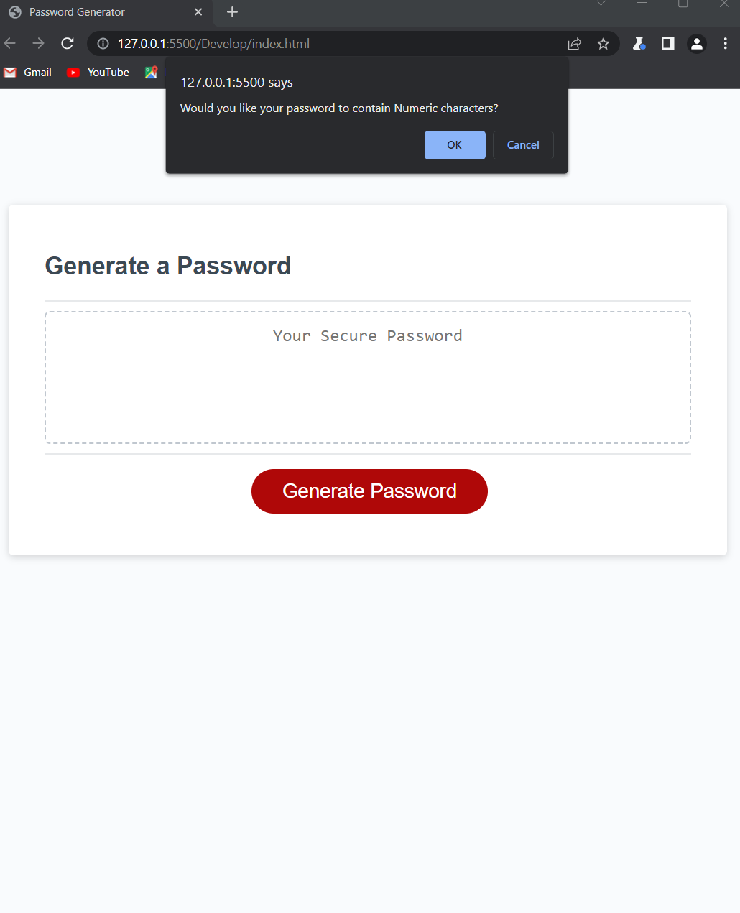

# Random Password Generator

## Description

This Webpage is a random password generator, It lets you choose the length of the password aswell as which type of characters you want to be added.

## Installation

N/A

## Usage

In order to generate your password you click on the red button and a pop-up window will appear, prompting you to choose a password length, please make sure to write the lenght in numbers, aswell as making sure that the password is at least 8 characters long, and no longer than 128. Afterwards a series of pop-up windows will appear prompting you to choose the ype of characters that will be added in the password, please choose at least one. After you get through the pop-ups your password will be generated and it will appear on the dotted space in the webpage.

Here is how it looks:

You can visit the website here: 

## Credits

N/A

## License

N/A